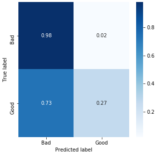
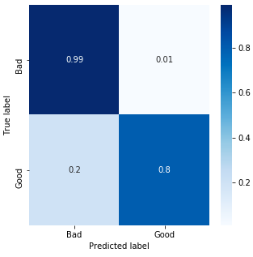

# Named Entity Recognition of diseases

## Introduction

Named-entity recognition (NER) is a task of NLP that seeks to locate and classify named entity mentioned in unstructured text. In this repository, I do a quick overview of supervised and unsupervised methods for this task. The goal is to find diseases in a given text, thus is a very specific case of NER.

There is an overview of the models and their results in this README, but you can find all the details in the notebooks:

- [Data Preprocess](./notebooks/Data%20Preprocess.ipynb)
- [NER with a Dictionary](./notebooks/NER%20with%20a%20Dictionary.ipynb)
- [NER with LSTM-CRF](./notebooks/NER%20with%20a%20LSTM-CRF.ipynb)

To run the previous notebooks, you need to install the Python libraries that are listed here: [requirements.txt](./misc/dockerfiles/python/requirements.txt). Or you can run the Docker containers which are described below.

## Dataset

The NCBI Disease Corpus: The NCBI disease corpus is fully annotated at the mention and concept level to serve as a research resource for the biomedical natural language processing community. Source: https://www.ncbi.nlm.nih.gov/CBBresearch/Dogan/DISEASE/

**Important:** Download the mentioned dataset and place the files `NCBI_corpus_training.txt` and `NCBI_corpus_testing.txt` in the folder `./data`. Once you put the files there, run the dockers (it is described in the next section) and run this command to prepare the dataset:
```sh
sh manager.sh init
```

## Commands

> Note: These commands have been tested only in MacOS, but they should work in Git Bash (Windows) too.

You can control the docker containers with these two commands:
```sh
sh manager.sh docker:run
sh manager.sh docker:down
```

Now, you have two commands that you can use to train the model and to make predictions:
```sh
sh manager.sh train "model-name"
sh manager.sh predict "model-name" "Write your text here..."
```

There are two model names that you can use: `dictionary` or `lstm-crf`. For example:
```sh
sh manager.sh train "lstm-crf"
sh manager.sh predict "lstm-crf" "Write your text here..."
```

Tip: remember that you can make predictions using `dictionary` without any previous training.

Have fun! ᕙ (° ~ ° ~)

## Algorithms

### Dictionary

This is a naive approach (**unsupervised algorithm**) of NER using a fixed list of medical terms and names of diseases. Basically, the NER will be as good as good is the list. I have used a scrapper to obtain a little list of diseases (source: https://www.nhsinform.scot/illnesses-and-conditions/a-to-z), I did a bit of manual parsing on the list and store them in the file `diseases.txt`. My goal is to see how good can be an algorithm based on such list.

A simlar approch is creating a list of Regular Expression for a particular language. Obviously, a person must create those patterns, so it can be hard to maintain a big list of patterns.


### LSTM-CRF

This approach (**supervised algorithm**) is based on the idea described at *Bidirectional LSTM-CRF Models for Sequence Tagging* by Zhiheng Huang et al.: https://arxiv.org/abs/1508.01991.


## Results

### Dictionary

A quick comparison show us the we are not detecting all the entities that we should be identify. On the one hand, I am not getting "false entities" (only around $2\%$) which it is pretty good. On the other hand, I only find around $27\%$ entities (very low).

It is not a really bad result for such small dictionary `diseases.txt`.



### LSTM-CRF

From my point of view, the results are nice: I do not get any false positive, thus I do not identify "false entities" in the text. However, I should keep working on my model to detect all the entities, since there are $34\%$ of them that I am not identifying correctly.



## Future work

I would like to implement the idea described at http://www.cogprints.org/5025/1/NRC-48727.pdf

Also, there are some tips to build regular expressions using the information from health organizations, for example: https://apps.who.int/iris/bitstream/handle/10665/163636/WHO_HSE_FOS_15.1_eng.pdf
