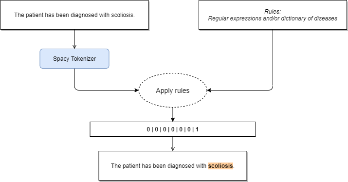
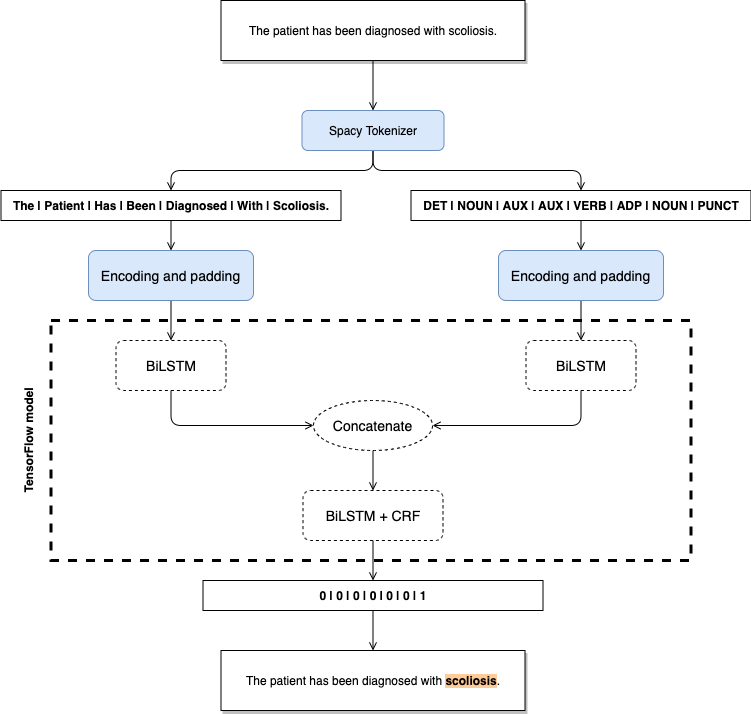

# Named Entity Recognition of diseases

## Introduction

Named-entity recognition (NER) is a task of NLP that seeks to locate and classify named entity mentioned in unstructured text. In this repository, I do a quick overview of supervised and unsupervised methods for this task. The goal is to find diseases in a given text, thus is a very specific case of NER.

There is an overview of the models and their results in this README, but you can find all the details in the notebooks:

- [Data Overview](./notebooks/Data%20Overview.ipynb)
- [NER with a Dictionary](./notebooks/NER%20with%20a%20Dictionary.ipynb)
- [NER with LSTM-CRF and PoS](./notebooks/NER%20with%20LSTM-CRF%20and%20PoS.ipynb)

To run the previous notebooks, you need to install the Python libraries that are listed here: [requirements.txt](./misc/dockerfiles/python/requirements.txt). Or you can run the Docker containers which are described below.

Also, you may need to install additional components, such as the vocabulary used by Spacy. If you receive any error when trying to import `en_core_web_sm`, try executing this command first: `python -m spacy download en_core_web_sm`.

## Dataset

The NCBI Disease Corpus: The NCBI disease corpus is fully annotated at the mention and concept level to serve as a research resource for the biomedical natural language processing community. Source: https://www.ncbi.nlm.nih.gov/CBBresearch/Dogan/DISEASE/

**Important:** Download the mentioned dataset and place the files `NCBI_corpus_training.txt` and `NCBI_corpus_testing.txt` in the folder `./data`. Once you put the files there, you are ready to run the commands described below.

## Commands

> Note: These commands have been tested only in MacOS, but they should work in Git Bash (Windows) too.

You can control the docker containers with these two commands:
```sh
sh manager.sh docker:run
sh manager.sh docker:down
```

Now, you have two commands that you can use to train the model and to make predictions:
```sh
sh manager.sh train "model-name"
sh manager.sh predict "model-name" "Write your text here..."
```

There are two model names that you can use: `dictionary` or `lstm-crf`. For example:
```sh
sh manager.sh train "lstm-crf"
sh manager.sh predict "lstm-crf" "Write your text here..."
```

Tip: remember that you can make predictions using `dictionary` without any previous training.

Have fun! ᕙ (° ~ ° ~)

## Algorithms

### Dictionary

This is a naive approach of NER using a fixed list of medical terms and names of diseases. Basically, the NER will be as good as good is the list. I have used a scrapper to obtain a little list of diseases (source: https://www.nhsinform.scot/illnesses-and-conditions/a-to-z), I did a bit of manual parsing on the list and store them in the file `diseases.txt`. My goal is to see how good can be an algorithm based on such list.

A simlar approch is creating a list of Regular Expression for a particular language. Obviously, a person must create those patterns, so it can be hard to maintain a big list of patterns.

<p align="center">
  
</p>

### LSTM-CRF with PoS

This approach (**supervised algorithm**) is based on the idea described at *Bidirectional LSTM-CRF Models for Sequence Tagging* by Zhiheng Huang et al.: https://arxiv.org/abs/1508.01991.

<p align="center">
  
</p>

## Results

I evaluated the performance of each algorithm using the Jaccard Index.
- Dictionary: 0.1369
- LSTM-CRF with PoS: 0.8154

Notes:
- I did not optimize the hyperparameters of the algorithms, so you may obtain better results if you do that.

## Future work

- I would like to implement the idea described at http://www.cogprints.org/5025/1/NRC-48727.pdf
- Using the information from health organizations, there are some tips to build regular expressions, for example: https://apps.who.int/iris/bitstream/handle/10665/163636/WHO_HSE_FOS_15.1_eng.pdf
- Apply K-Folds to training of LSTM-CRF.
- Use GloVe embeddings to improve performance.
- Code organization
